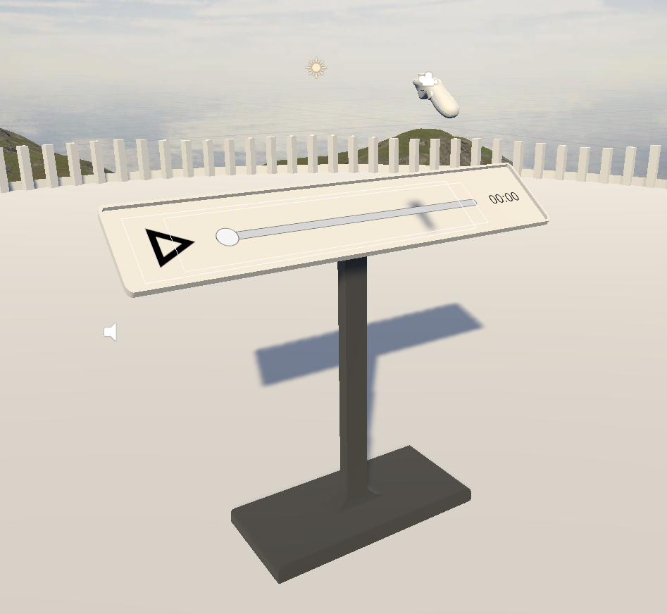

# 💾 Prezentace

<figure><figcaption>
1 - přehrávač
</figcaption></figure>

## 1. Stručný popis

Prezentace momentálně podporuje tři přehratelné "Playable" objekty - Zvukovou stopu, Video a Animaci. Připravené objekty stačí přidat do scény, dát jim Playable component a script je sám rozpozná a zařadí do fronty přehrávání. Hlavní logika přehrávače prezentace je v PlayerManager.cs scriptu. V cyklu se zjistí všechny objekty s komponentem Playable a na nich se spouští metody:

* PlayPause() - pozastaví, nebo naopak spustí daný playable objekt, vycházejíc z toho, v jakém stavu momentálně je
* Scrub(int time) - přesune playable na čas určený funkcí, tato funkce je volána ze slideru, který je vidět na obrázku 1

